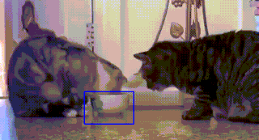

# 📝 GPU (Correlation Filter based) MOSSE Tracker #
***
Simple MOSSE tracker by correlation filters

<p align="center">
  
</p>

## :tada: TODO ##
***

- [x] gpu python version of MOSSE tracker using pytorch tensor

## 🎛  Dependencies ##
***

- conda environment

```bash
conda env create --file environment.yml
conda activate mosse_tracker
```

## :running: How to Run ##
***

```bash
python scripts/test_tracker.py --use_gpu --video_path ./data/two_cats.mp4
```

## :gem: References ##
***

1. [Visual Object Tracking using Adaptive Correlation Filters](https://www.cs.colostate.edu/~draper/papers/bolme_cvpr10.pdf)
